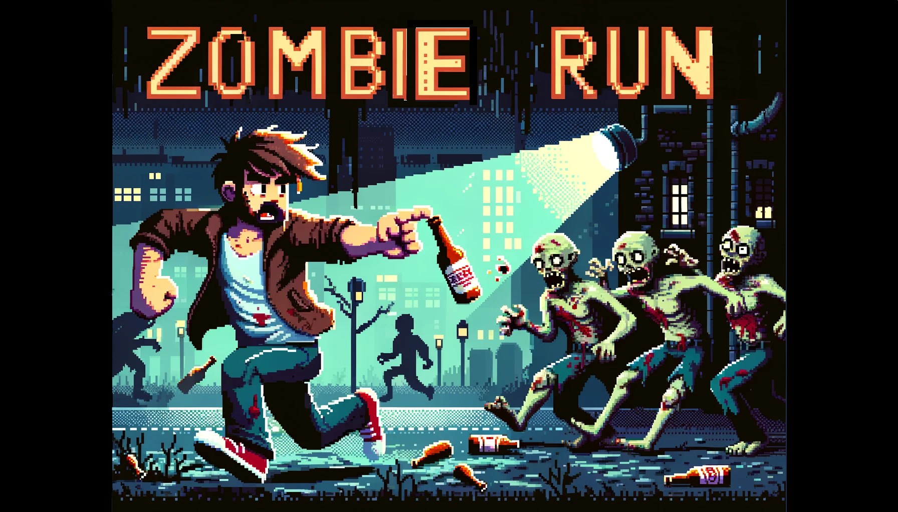

# Zombie Run :beer:



## História do Jogo

Jack, completamente alheio ao que estava acontecendo, estava no meio de uma bebedeira quando ouviu os primeiros gritos. Cambaleando para fora do bar com uma garrafa de cerveja na mão, ele se deparou com um cenário apocalíptico. Zumbis estavam por toda parte, e ele sabia que precisava fugir para salvar sua vida.

Armado com sua determinação bêbada e algumas garrafas de cerveja, Jack começa sua corrida desesperada. Ele deve evitar os zumbis e usar suas garrafas de cerveja para afastá-los, enquanto tenta encontrar um lugar seguro.

## Créditos

- **Desenvolvedores**: Correia1500, MarianaSquillante, FelipeBSPereira.
- **Arte**: Chat-GPT 
- **Agradecimentos**: Agradecimentos especiais a [Fontes de Recursos Gratuitos] como Pexels, Unsplash, OpenGameArt, Pixabay, Freesound entre outros.

## Como Baixar

1. Clone o repositório:
    ```sh
    git clone https://github.com/Correia1500/zombie-run.git
    ```
2. Navegue até o diretório do projeto:
    ```sh
    cd zombie-run
    ```
3. Instale o pygame:
    ```sh
    pip install pygame
    ```

## Como Jogar !

1. Execute o jogo:
    ```sh
    python main.py
    ```

2. Controles:
    - **Seta para a esquerda**: Mover para a esquerda
    - **Seta para a direita**: Mover para a direita
    - **Barra de espaço**: Pular
    - **Tecla A**: Atirar garrafas de cerveja

3. Objetivo:
    - Evitar os zumbis e outros obstáculos.
    - Usar as garrafas de cerveja para afastar os zumbis.
    - Sobreviver o máximo de tempo possível e alcançar a maior pontuação.

Divirta-se jogando Zombie Run!
## Game Play: 
    - **link:**https://youtu.be/d1mN_q51YJY

---

**Nota**: As instruções de instalação podem variar dependendo do seu sistema operacional e ambiente de desenvolvimento. Certifique-se de ter Python instalado.

